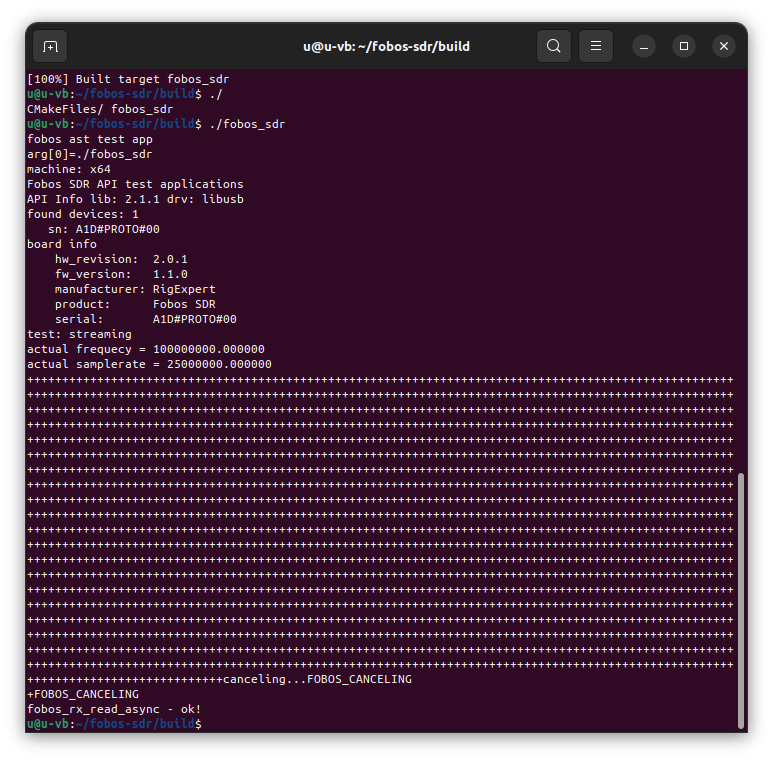

# RigExpert Fobos SDR API

This is the Fobos SDR receiver host software API library and basic standalone test application. Extremely lightweight and easy to start. Full source code.

## Platforms tested on

- Linux (Ubuntu 18.04 LTS, Ubuntu 22.04 LTS, Raspbian ...)
- Windows (7, 8.1, 10, 11)

## Requirements

- git v.2.31 or later (otherwise download the repository manualy: Code->Download ZIP)
- cmake v.3.10 or later (otherwise create a project manualy: makefile, *.sln, etc)
- any c compiler (tested on gcc, g++, mingw, msvc) 

## Dependencies

- libusb-1.0-0 v.1.0.21 or higher

## How to build and evaluate

### Linux

git clone [this repo] 
cd fobos-sdr 
sudo cp fobos-sdr.rules /etc/udev/rules.d/00-fobos-sdr.rules 
sudo udevadm control --reload-rules 
sudo udevadm trigger 
mkdir build 
cd build 
cmake .. 
make 
./fobos_sdr 

### Windows

git clone [this repo] 
cd fobos-sdr 
mkdir build 
mkdir libusb 
cd build 
cmake .. 

Visit https://github.com/libusb/libusb/releases 
Download any libusb release 7z pack, for example  libusb-1.0.27.7z 
Unpack content of **libusb-1.0.27.7z** to **libusb** directory 

cmake build . 
or 
open fobos_sdr.sln in your favorite MS VisualStudio IDE, 
build, debug, trace, evaluate. 

## How it looks like (Ubuntu 22.04 LTS)

 

## How to use Fobos SDR API elsewhere

- copy **fobos.c** and **fobos.h** from  **fobos** subdirectory to your **c/c++** project location
- link **fobos.c**  and include **fobos.h** to your project
- see **recorder/main.c** and make your own similar 
- build, run and have a fun

## What is actually Fobos SDR

For more info visit the main product page

https://rigexpert.com/en/products/kits-en/fobos-sdr/
